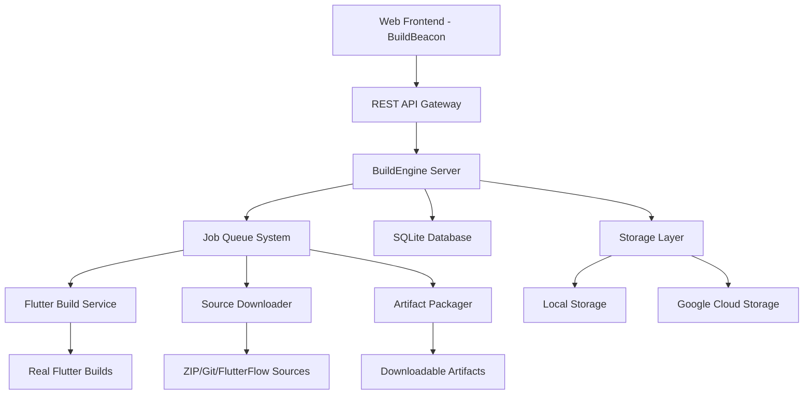

# BuildEngine 🚀

**Automated Flutter & FlutterFlow App Building Made Simple!**

Transform your Flutter development workflow with BuildEngine - a comprehensive platform that eliminates the complexity of setting up development environments while providing powerful build automation capabilities.

[](LICENSE)
[](https://flutter.dev)
[](https://dart.dev)

## 🎯 What is BuildEngine?

BuildEngine is a production-ready platform that automates Flutter app builds through an intuitive web interface. Whether you're working with Flutter projects, FlutterFlow exports, or Git repositories, BuildEngine provides a seamless build experience with real-time monitoring and artifact delivery.

### ✨ Why BuildEngine?

- **🚫 No Local Setup Required**: Build Flutter apps without installing Flutter SDK locally
- **⚡ Lightning Fast**: Optimized build pipeline with caching and parallel processing
- **🔄 Real-time Feedback**: Live build logs and progress tracking
- **🌐 Universal Access**: Web-based interface accessible from anywhere
- **🔒 Enterprise Ready**: Secure builds with artifact management and access controls

## 🚀 Quick Start

### 📦 Upload & Build
```bash
1. 📁 Upload your Flutter project (ZIP file)
2. ⚙️ Configure build settings (platforms, versions, etc.)
3. 🏗️ Watch real-time build progress
4. ⬇️ Download your compiled artifacts
```

### 🔗 FlutterFlow Integration
```bash
1. 🔗 Paste your FlutterFlow project URL
2. 🔑 Add authentication token (if private)
3. ⚡ Automatic source download and build
4. 📱 Get your web-ready Flutter app
```

## 🎯 Key Features

### 🔌 **Multi-Source Support**
- **📦 ZIP Uploads**: Drag & drop your Flutter project archives
- **🌊 FlutterFlow Projects**: Direct integration with FlutterFlow exports
- **📂 Git Repositories**: Clone and build from public/private repos
- **🔄 Auto-Sync**: Automatic updates from connected sources

### 📊 **Real-Time Monitoring**
- **🔴 Live Build Logs**: WebSocket-powered streaming logs
- **📈 Progress Tracking**: Visual build pipeline with status indicators
- **⏱️ Performance Metrics**: Build time tracking and optimization insights
- **🔔 Smart Notifications**: Status updates and completion alerts

### 💾 **Flexible Storage**
- **💻 Local Storage**: Perfect for development and testing
- **☁️ Google Cloud Storage**: Scalable production deployments
- **🔐 Secure URLs**: Time-limited download links for artifacts
- **📊 Usage Analytics**: Storage metrics and cost optimization

### ⚙️ **Advanced Build Configuration**
- **🏗️ Custom Flutter Versions**: Support for specific Flutter SDK versions
- **🎯 Build Types**: Release, debug, and profile builds
- **📱 Multi-Platform**: Web, Android APK, iOS, desktop platforms
- **🔧 Custom Steps**: Pre/post-build command execution
- **🚀 Build Optimization**: Caching and incremental builds

### 👥 **Team Collaboration**
- **📋 Job Management**: Queue, cancel, retry builds with full history
- **🔍 Advanced Filtering**: Search and filter builds by status, date, source
- **📊 Team Dashboard**: Shared build status and metrics
- **🔒 Access Control**: User-based permissions and team management

## 🏗️ Architecture



### 🔧 **Tech Stack**

#### Backend (Server)
- **⚡ Dart Server**: High-performance HTTP server with shelf framework
- **🗄️ SQLite Database**: Lightweight, embedded database for job tracking
- **☁️ Storage Options**: Local filesystem or Google Cloud Storage
- **🔗 REST API**: Complete v1 API with OpenAPI compliance
- **📡 WebSocket Support**: Real-time log streaming

#### Frontend (BuildBeacon)
- **🎨 Flutter Web**: Modern, responsive web interface
- **🔄 Riverpod**: Robust state management with real-time updates
- **🧭 GoRouter**: Type-safe navigation and deep linking
- **📡 Dio HTTP Client**: Efficient API communication with retry logic
- **🎯 Material Design**: Polished UI with custom theming

## 📖 Getting Started

### 🔧 **Prerequisites**
- Dart SDK 3.0+ 
- Flutter SDK 3.6+ (for frontend development)
- Git (for repository operations)

### ⚡ **Quick Installation**

1. **Clone the Repository**
   ```bash
   git clone https://github.com/ff-vivek/buildengine.git
   cd buildengine
   ```

2. **Start the Backend Server**
   ```bash
   cd server
   dart pub get
   dart run bin/buildengine_server.dart
   ```
   Server runs on `http://127.0.0.1:8788`

3. **Launch the Frontend**
   ```bash
   cd frontend/buildbeacon
   flutter pub get
   flutter run -d chrome
   ```
   Web app opens at `http://localhost:3000`

### 🐳 **Docker Deployment**
```bash
# Full stack deployment
docker-compose up -d

# Access at http://localhost:8788
```

## 🎮 Usage Examples

### 1. **Flutter Project Build**
```bash
1. 📁 Upload your Flutter project ZIP
2. ⚙️ Select target platforms (web, APK, etc.)
3. 🔧 Configure Flutter version and build type
4. 🚀 Start build and monitor progress
5. ⬇️ Download artifacts when complete
```

### 2. **FlutterFlow Integration**
```bash
1. 🔗 Paste FlutterFlow project URL
2. 🔑 Add access token (for private projects)
3. ⚡ Automatic download and build
4. 📱 Get production-ready Flutter web app
```

### 3. **Git Repository Build**
```bash
1. 📂 Provide Git repository URL
2. 🌿 Specify branch (default: main)
3. 🔧 Configure build settings
4. 🏗️ Automated clone and build process
```

## 🎯 Perfect For

### 👨‍💻 **Developers**
- **🆕 Flutter Beginners**: No need for complex local setup
- **🔄 CI/CD Integration**: Automated builds in pipelines
- **🧪 Quick Prototyping**: Rapid iteration and testing
- **🌍 Remote Development**: Build from anywhere with web access

### 🏢 **Teams & Organizations**
- **📏 Standardized Builds**: Consistent environments across team
- **⚡ Faster Onboarding**: New developers productive immediately
- **💰 Cost Optimization**: Reduce local development machine requirements
- **🔒 Security**: Centralized build process with audit trails

### 🎓 **Educational Use**
- **🏫 Classroom Teaching**: Students focus on code, not setup
- **📚 Flutter Workshops**: Eliminate installation bottlenecks
- **🎯 Learning Focus**: Concentrate on app development concepts

## 🎬 Live Demos

### 🌊 **FlutterFlow Integration Demo**
[](https://www.loom.com/share/30ea44ec59684fbb96a693ddbfde7638?sid=8ad0d3c7-6cbb-4f55-b60d-32db44e06682)

See how BuildEngine seamlessly integrates with FlutterFlow projects for instant web deployment.

### 📱 **Flutter Project Demo**
[](https://www.loom.com/share/2f3b4aefc3b64daba692726a4821227b?sid=004dca98-a546-4acf-9d86-a0e162fdf21f)

Watch the complete workflow from ZIP upload to artifact download.

## 📚 Documentation

- **🔧 [Server Setup Guide](server/README.md)** - Backend installation and configuration
- **🎨 [Frontend Guide](frontend/buildbeacon/README.md)** - Web interface setup and usage
- **📋 [API Documentation](server/docs/api_prd.md)** - Complete REST API reference
- **🏗️ [Architecture Guide](frontend/buildbeacon/architecture.md)** - System design and implementation details

## 🤝 Contributing

We welcome contributions! Please see our [Contributing Guidelines](CONTRIBUTING.md) for details.

### 🚀 **Development Workflow**
1. 🍴 Fork the repository
2. 🌿 Create a feature branch (`git checkout -b feature/amazing-feature`)
3. 💻 Make your changes with tests
4. ✅ Run tests and linting
5. 📝 Commit changes (`git commit -m 'Add amazing feature'`)
6. 📤 Push to branch (`git push origin feature/amazing-feature`)
7. 🔄 Open a Pull Request

## 📄 License

This project is licensed under the MIT License - see the [LICENSE](LICENSE) file for details.

## 🌟 Support

- **🐛 [Report Issues](https://github.com/ff-vivek/buildengine/issues)** - Bug reports and feature requests
- **💬 [Discussions](https://github.com/ff-vivek/buildengine/discussions)** - Community support and ideas
- **📧 Contact**: For enterprise support and custom implementations

## 🎉 Acknowledgments

- **Flutter Team** for the amazing framework
- **FlutterFlow** for the visual development platform
- **Dart Team** for the powerful language and ecosystem
- **Open Source Community** for inspiration and contributions

---

<div align="center">

**⭐ Star this repository if BuildEngine helped you!**

[](https://github.com/ff-vivek/buildengine/stargazers)
[](https://github.com/ff-vivek/buildengine/network)

Built with ❤️ by the BuildEngine Team

</div>